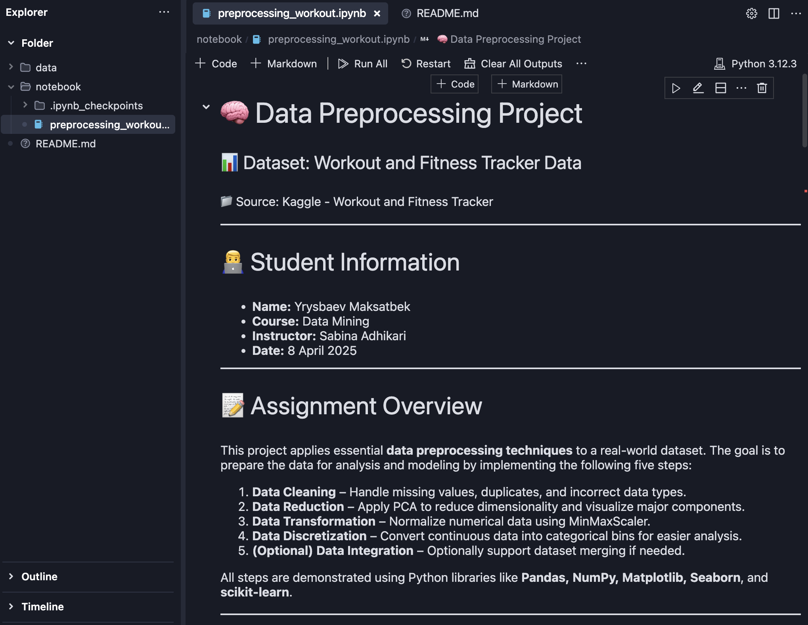

# 🏋️‍♂️ Workout Clustering Analysis – Data Mining Project

This repository contains a Jupyter Notebook that demonstrates K-Means clustering applied to a **Workout and Fitness Tracker** dataset.  
The project is part of Homework 3 & 4 for the Data Mining course.

---

## 📁 Dataset

- **Name:** Workout and Fitness Tracker Data  
- **Source:** [Kaggle Dataset Link](https://www.kaggle.com/datasets/adilshamim8/workout-and-fitness-tracker-data)  
- **Format:** CSV

---

## 🔍 Project Goals

The notebook focuses on applying **Cluster Analysis** to uncover patterns and group workout sessions based on intensity.  
Key steps include:
- Feature selection (duration, calories, heart rates)
- Data scaling (StandardScaler)
- K-Means clustering (3 clusters)
- Visualization (scatter plots, boxplots)
- Cluster interpretation and insights

---

## 📊 Findings

The analysis identified three main clusters:
1. **High-Intensity Workouts** → Long duration, high calories, high heart rate  
2. **Moderate Workouts** → Medium duration, moderate calories, average heart rate  
3. **Light Workouts** → Short duration, low calories, lower heart rate

These insights help understand workout patterns and guide fitness goal setting.

---

## 🛠 Technologies Used

- Python 🐍
- Jupyter Notebook 📒
- pandas, numpy
- matplotlib, seaborn
- scikit-learn

---

## 📸 Preview

 <!-- Optional: Add a scatter plot or boxplot screenshot -->

---

## 👤 Author

**Yrysbaev Maksatbek**  
North American University  
April 2025

---

## 📜 License

This project is intended for educational purposes.  
The dataset’s license and usage rights belong to the original authors on Kaggle.

